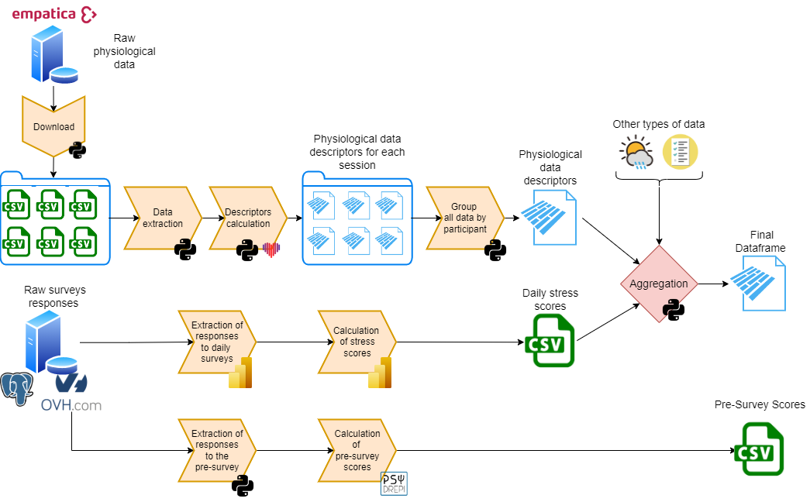
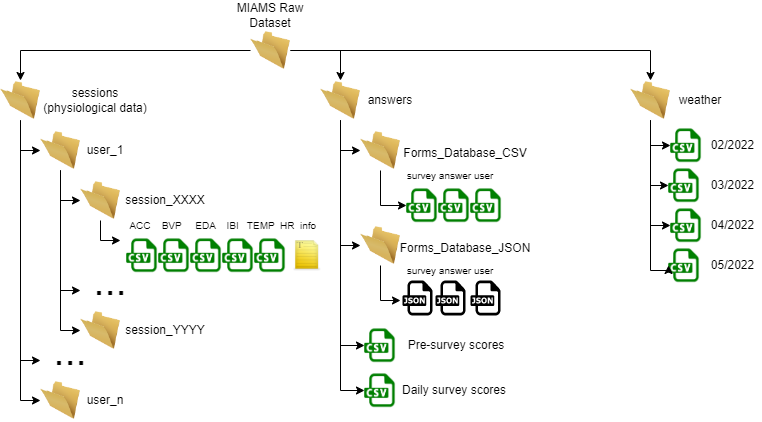

# Data acquisition, formating and analysis

## 1. Data acquisition

__db_access.py__ : 

Set of classes and methods to access and manipulate the database on the server during the data acquisition campaign. This database stores the forms as well as the answers that the participants have filled in.

__e4_access.py__ :

Python client developed to access physiological data on Empatica servers. Basic project on which we based our work: https://github.com/khvilaboa/e4-client

__monitoring_report.py__ :

Generation of daily reports for campaign monitoring. These reports show the amount of data that each current participant has provided.
The participants to be processed are taken from the Teams match file (Correspondances_SN_Codes). The data are extracted directly from the server database for the survey answers and from the Empatica server for the physiological data. You can see an example [here](./readme_data/Report_2022-03-18.pdf).

__physio_data_presentation.py__ :

Code to generate a presentation of all the raw data collected during the data acquisition campaign. You can see result [here](./readme_data/Raw_physio_data_presentation.pdf).

## 2. Data formating
main notebook file: gen_5_final_dataframe_generation.ipynb

Overview:

Not all the steps have been done with Python code, so they will not be explained here.

__0_raw_dataset_generation.py__ : 

Generation of the dataset architecture and download of the physiological data of each participant in the right directories. As for the answers to the forms and the weather data, they are processed differently and then added by hand to the folders provided. Here is an overview of the result : 

__gen_1_physiological_features_computing.py__ :

Copy the architecture of the MIAMS_Raw_Dataset to generate the MIAMS_features. Calculates the physiological data features according to the [computing parameters](./Code/computing_parameters.py) entered for each session of each participant using the [Flirt library](https://flirt.readthedocs.io/en/latest/).

__gen_2_physiological_features_merging.py__ :

Merges the features that were calculated for each session for each participant. Then merges the result of the previous operation to obtain a file containing the descriptors of all participants.

__gen_3_meteorological_data_treatment .py__ :

Merges the meteorological data of the 5 months during which the data acquisition campaign took place. Filters to keep only the interesting data concerning Dijon. In addition, a rolling average is calculated for some of these indicators. It is the result of the difference between the average of the day and the average of the last 5 days. The purpose of this operation is to highlight changes in trends over time.

__gen_4_hbh_data_merging.py__ :

Last step for the generation of the Pandas Dataframe. This code allows us to merge all types of data we have into a single Dataframe: descriptors (physiological data), stress scores (surveys responses), weather data and others.

__gen_5_final_dataframe_generation.ipynb__ :

Jupyter Notebook describing in more detail all the steps to transform the MIAMS_raw and obtain the Pandas Dataframe.

__gen_6_on_demand_survey_dataframe_generationpy__ :

Reads the extract from the survey_answer table to extract responses to the on-demand surveys. Store result in [on_demand_survey_dataframe](./Dataframe/on_demand_survey_dataframe).

## 3. Data Analysis
main notebook file : ml_notebook.ipynb

### Notes (in french)

Pour génerer le "requierements.txt":
    `pip install pipreqs`
    `pipreqs /path/to/project`

Pour se connecter à la base de données avec pygresql:
- https://www.a2hosting.com/kb/developer-corner/postgresql/
- connecting-to-postgresql-using-python/

Pour la classe MyE4Connect je me suis basé sur le git suivant:
- https://github.com/khvilaboa/e4-client
- https://e4-client.readthedocs.io/en/latest/
En soit il fonctionnait très bien mais ne permettait pas d'accèder aux "studies".

Problèmes avec psql, liens utiles : 
    https://stackoverflow.com/questions/28628836/ver-2-pygresql-error-from-pg-import-importerror-dll-load-failed-the-specif

Problème si le mot de passe de la base de données contient des accents (é ou è par exemple):
    Bien lire le csv de cette facon --> with open(file_name, encoding="utf8") as csv_file:

Problème de conflit entre pg et PipGreSql :
- https://stackoverflow.com/questions/65623002/import-pg-erroring-out-in-python3-9
Solution: enlever pg du requirement.txt

Pour les dates, heures et données 
https://blog.statoscop.fr/timeseries-1.html

Bonne pratique concernant les grands dataset :
https://blog.octo.com/machine-learning-7-astuces-pour-scaler-python-sur-de-grands-datasets/

Pour les types de données empatica
https://support.empatica.com/hc/en-us/sections/200582445-E4-wristband-data

Biblihothèque pour lire les donnée empatica
https://flirt.readthedocs.io/en/latest/api.html

Fichier "db_connection_config.csv" :

    host;<adress ip>
    user;<nom d'utilisateur>
    passwd;<mot de passe>
    dbname;<nom de la BD>
    port;<numero de port>

Fichier"empatica_connection_config.csv" :

    user;<nom d'utilisateur>
    pwd;<mot de passe>

Pour en savoir plus sur les données Empatica :
    IBI --> https://support.empatica.com/hc/en-us/articles/360030058011-E4-data-IBI-expected-signal
    EDA --> https://support.empatica.com/hc/en-us/articles/360030048131-E4-data-EDA-Expected-signal
    BVP --> https://support.empatica.com/hc/en-us/articles/360029719792-E4-data-BVP-expected-signal

 

 Traitement du signal

 Problem with EDA analysis because of low sampling rate (Empatica E4)
    https://github.com/neuropsychology/NeuroKit/issues/554

Pour les jours fériés et vacances, package qui auraient pu etre utilisé :
    https://pypi.org/project/jours-feries-france/
    https://pypi.org/project/vacances-scolaires-france/

Sinon on a l'info ici :
    https://ub-link.u-bourgogne.fr/wp-content/uploads/CAL_sciences_humaines_correction-coquille_V1.pdf
    https://ub-link.u-bourgogne.fr/wp-content/uploads/2019/07/CAL_sciences_humaines_suspension_cours.pdf

